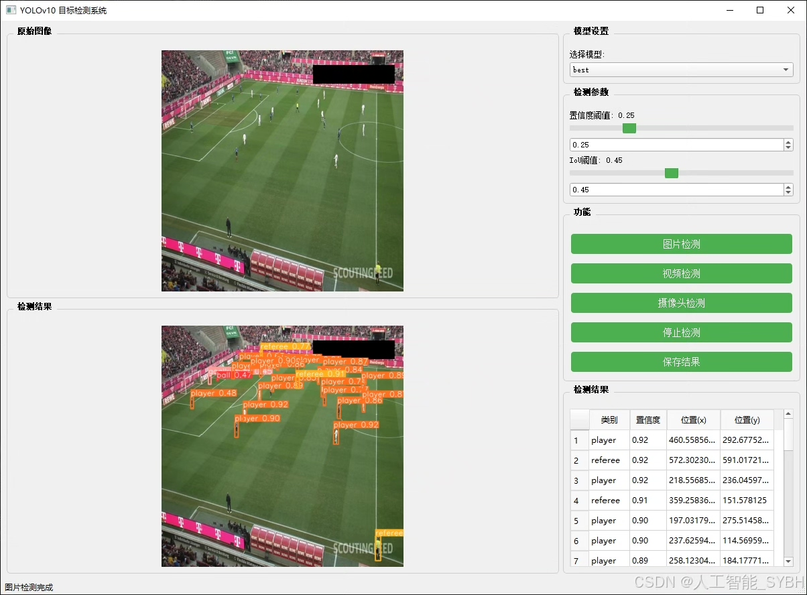
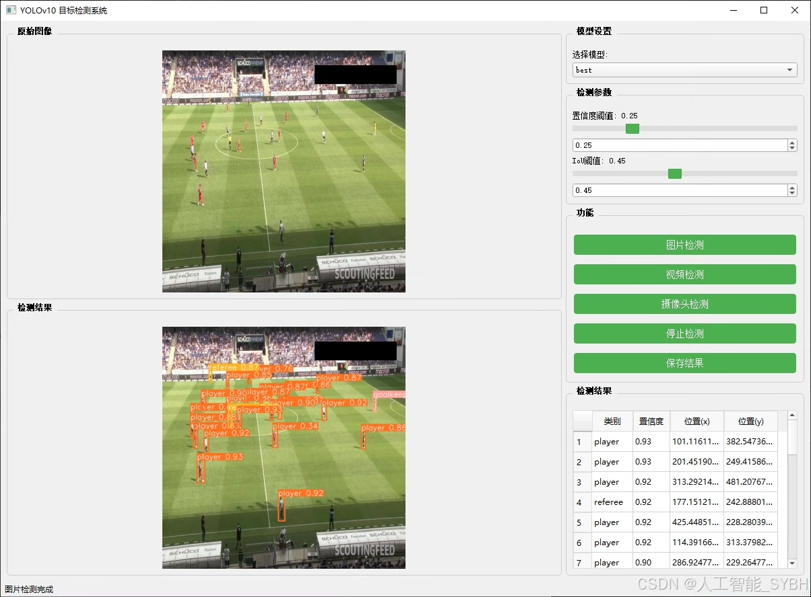
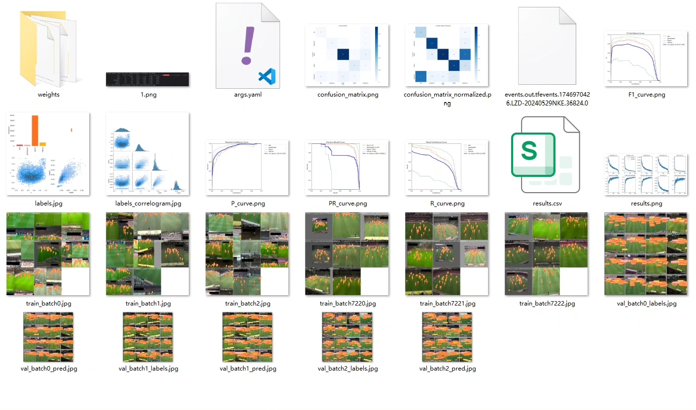
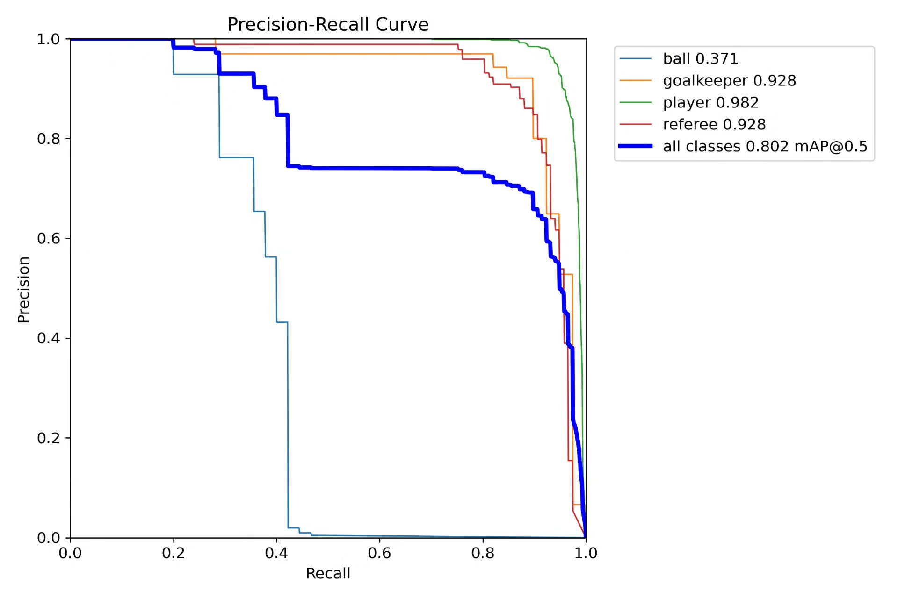
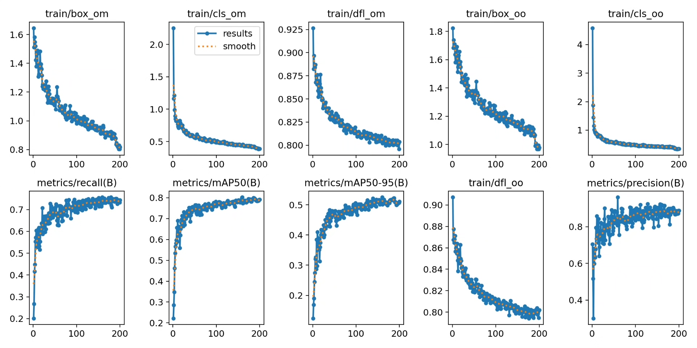
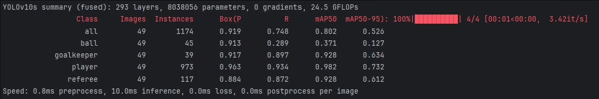
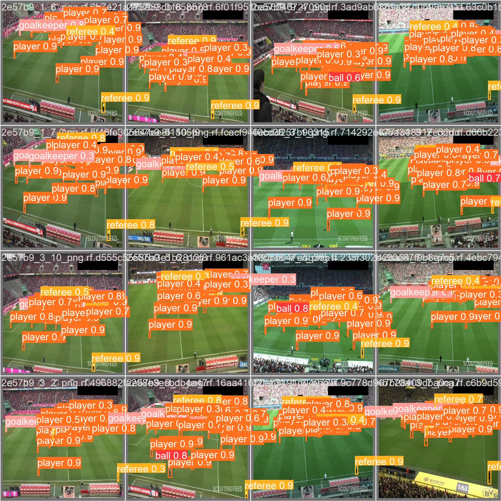
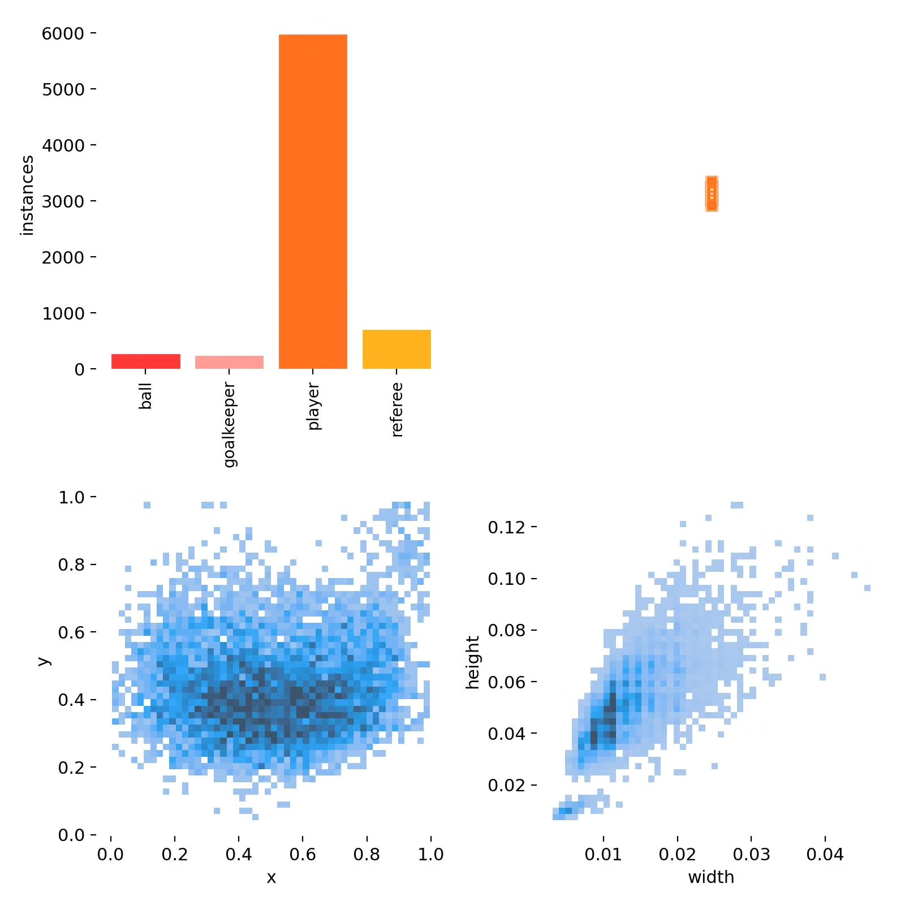

# Football Player Detection System Based on Deep Learning YOLOv10

## Body

This project is based on the YOLOv10 object detection algorithm, developing a high-efficiency and real-time football player detection system for identifying and classifying key targets in football matches. This includes players (player), goalkeepers (goalkeeper), referees (referee) and balls (ball). The system is trained and optimized to achieve precise detection of different roles in football match scenes.

The company's products have obtained the official commercial license certification from YOLO.

We provide after-sales service.

After payment, we will provide WeChat IDs for any questions.

Environment configuration: We will provide an environment configuration tutorial, and WeChat will provide answers.

Remote installation service: If you need remote configuration, an additional fee of 69 is required, with all fees refunded if the configuration fails (only the installation fee is refunded for special old computers).

Retraining dataset: After setting up the environment, you can train on your own computer. If you need us to retrain, just pay 69 plus computing power fees (2.5 yuan/hour).

Full after-sales service

## Images

## Payment

Here is a pay link on Stripe ( https://buy.stripe.com/3cs8yP7sY87d0vu9AB ). Please contact me lonlonago@foxmail.com after funding $89, and I will send you a complete data files , thank you!

